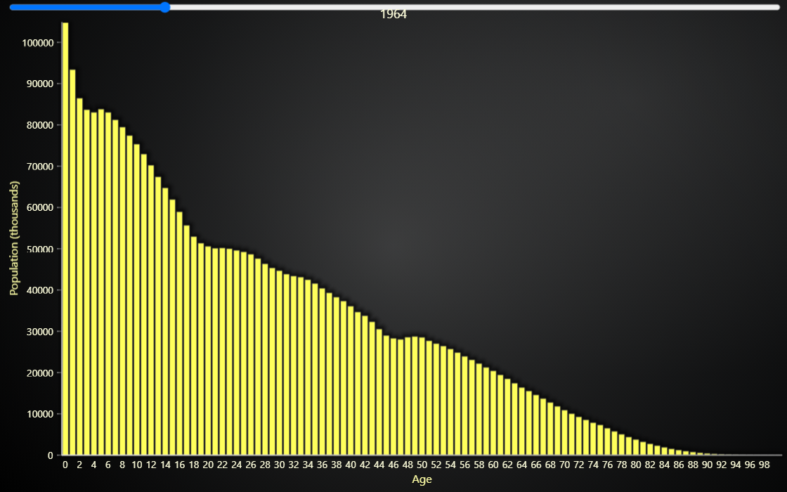

# JavaScript Histogram of world population.

This demo application belongs to the set of examples for LightningChart JS, data visualization library for JavaScript.

LightningChart JS is entirely GPU accelerated and performance optimized charting library for presenting massive amounts of data. It offers an easy way of creating sophisticated and interactive charts and adding them to your website or web application.

The demo can be used as an example or a seed project. Local execution requires the following steps:

-   Make sure that relevant version of [Node.js](https://nodejs.org/en/download/) is installed
-   Open the project folder in a terminal:

          npm install              # fetches dependencies
          npm start                # builds an application and starts the development server

-   The application is available at _http://localhost:8080_ in your browser, webpack-dev-server provides hot reload functionality.

## Description

Example showcasing LightningChart Histogram visualization using Bar Chart.

In this example, a world population dataset is visualized. The dataset is from [United Nations](https://population.un.org/wpp/Download/Standard/CSV/) and it includes world population by age per year.

This example includes a HTML slider input to select the year to be visualized. The chart updates automatically from these interactions. The automatic slider progression animation can be paused and replayed by pressing the space bar.

## API Links

* [Bar Chart]
* [Bar Chart Bar]
* [Bar Chart Value Axis ]
* [Bar Chart Category Axis]
* [Bar Chart Types]
* [Bar Chart Sorting]

## Support

If you notice an error in the example code, please open an issue on [GitHub][0] repository of the entire example.

Official [API documentation][1] can be found on [LightningChart][2] website.

If the docs and other materials do not solve your problem as well as implementation help is needed, ask on [StackOverflow][3] (tagged lightningchart).

If you think you found a bug in the LightningChart JavaScript library, please contact support@lightningchart.com.

Direct developer email support can be purchased through a [Support Plan][4] or by contacting sales@lightningchart.com.

[0]: https://github.com/Arction/
[1]: https://lightningchart.com/lightningchart-js-api-documentation/
[2]: https://lightningchart.com
[3]: https://stackoverflow.com/questions/tagged/lightningchart
[4]: https://lightningchart.com/support-services/

© LightningChart Ltd 2009-2022. All rights reserved.

[Bar Chart]: https://lightningchart.com/js-charts/api-documentation/v4.2.0/interfaces/BarChart.html
[Bar Chart Bar]: https://lightningchart.com/js-charts/api-documentation/v4.2.0/
[Bar Chart Value Axis ]: https://lightningchart.com/js-charts/api-documentation/v4.2.0/classes/BarChartValueAxis.html
[Bar Chart Category Axis]: https://lightningchart.com/js-charts/api-documentation/v4.2.0/classes/BarChartCategoryAxis.html
[Bar Chart Types]: https://lightningchart.com/js-charts/api-documentation/v4.2.0/
[Bar Chart Sorting]: https://lightningchart.com/js-charts/api-documentation/v4.2.0/

